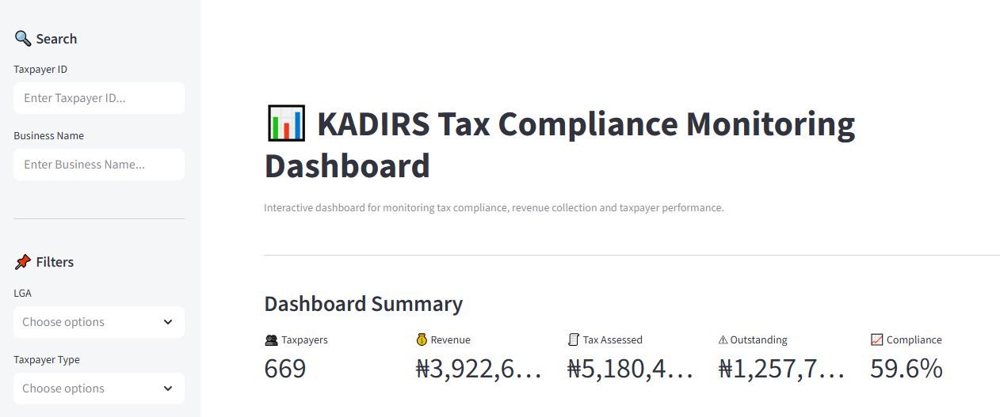
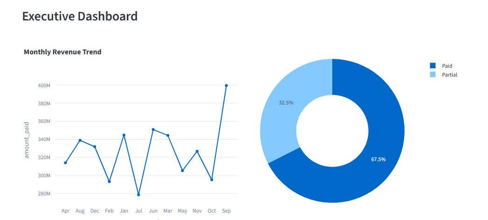

# KADIRS Tax Compliance Monitoring Dashboard

An interactive **Tax Compliance Monitoring Dashboard** built for the **Kaduna State Internal Revenue Service (KADIRS)**. The project covers the full analytics workflow — from raw tax-compliance data cleaning and validation, through exploratory data analysis and KPI engineering, to an interactive Streamlit dashboard for monitoring compliance, revenue, audit performance, and defaulters.


---

## 📌 Overview

KADIRS is responsible for assessing, collecting, and accounting for internally generated revenue in Kaduna State. This project delivers a single, interactive view of tax-compliance health so that revenue officers can:

- Track compliance and filing behaviour across LGAs and sectors.
- Monitor revenue collection trends over time.
- Identify top defaulters and high-risk taxpayers.
- Follow audit progress and outcomes.
- Drill into KPIs that summarise overall performance.

The work is split into two parts:

1. **Analysis pipeline** — a set of Jupyter notebooks that load, clean, validate, explore, and compute KPIs from the raw compliance data, producing ready-to-use summary tables.
2. **Interactive dashboard** — a Streamlit app that visualises the cleaned data and summary tables with Plotly charts, filters, and KPI cards.

---

## ✨ Features

The dashboard exposes the following views (see screenshots below):

- 🏠 **Home / overview** — high-level summary and navigation.
- 🧭 **Sidebar navigation** — switch between dashboard sections.
- 📊 **Key Performance Indicators (KPIs)** — compliance rate, collection rate, filing rate, and other headline metrics.
- ✅ **Compliance analysis** — compliance status distribution and trends.
- 💰 **Revenue analysis** — revenue by LGA, sector, and month.
- 🕵️ **Audit analysis** — audit coverage, findings, and outcomes.
- 🔍 **Search bar** — look up specific taxpayers / records.
- ⚠️ **Top defaulters** — ranked list of taxpayers with the highest outstanding liabilities.

---

## 🛠️ Tech Stack

| Area | Technology |
|------|-----------|
| Dashboard framework | **Streamlit** |
| Data processing | **pandas** |
| Visualisation | **Plotly Express** |
| Analysis / notebooks | **Jupyter Notebook** |
| Data format | CSV |

---

## 📁 Project Structure

```
KADIRS-analysis-and-dashboard/
├── dashboard/
│   ├── app.py              # Streamlit dashboard application
│   └── assets/
│       └── style.css       # Dashboard custom styling
├── data/
│   ├── KADIRS_Tax_Compliance.csv            # Raw source data
│   ├── KADIRS_Tax_Compliance_2000_Rows.csv  # Sample subset
│   ├── cleaned_KADIRS_Tax_Compliance.csv    # Cleaned data
│   ├── validated_KADIRS_Tax_Compliance.csv  # Validated data (used by dashboard)
│   └── *_summary.csv / *_revenue.csv / top_defaulters.csv  # Engineered summary tables
├── nootbook/
│   ├── 01_Data_Loading_and_Exploration.ipynb
│   ├── Data Cleaning and Preprocessing.ipynb
│   ├── 04_Exploratory_Data_Analysis.ipynb
│   ├── 05_Advanced_EDA_and_Business_Insights.ipynb
│   └── 06_KPI_Calculations.ipynb
└── *.JPG                   # Dashboard screenshots
```

---

## 🔬 Analysis Pipeline (Notebooks)

The notebooks follow a reproducible workflow:

1. **01 — Data Loading & Exploration** — inspect raw schema, dtypes, missing values, and basic distributions.
2. **Data Cleaning & Preprocessing** — handle missing/invalid values, standardise formats, enforce data types, deduplicate.
3. **04 — Exploratory Data Analysis** — univariate and bivariate analysis to surface patterns.
4. **05 — Advanced EDA & Business Insights** — deeper, business-oriented analysis (compliance, revenue, risk).
5. **06 — KPI Calculations** — compute the headline KPIs and summary tables consumed by the dashboard.

The validated dataset (`data/validated_KADIRS_Tax_Compliance.csv`) is the single source of truth that feeds `dashboard/app.py`.

---

## 🚀 Running the Dashboard

### Prerequisites

- Python 3.9+
- pip

### Install dependencies

```bash
pip install streamlit pandas plotly
```

### Launch

```bash
cd dashboard
streamlit run app.py
```

The app loads `../data/validated_KADIRS_Tax_Compliance.csv` by default and opens at `http://localhost:8501`.

---

## 📈 Key KPIs

The dashboard summarises performance with metrics such as:

- **Compliance rate** — share of taxpayers meeting their obligations.
- **Collection rate** — collected revenue vs assessed revenue.
- **Filing rate** — proportion of expected returns filed.
- **Revenue by LGA / sector / month** — where revenue comes from and when.
- **Top defaulters** — taxpayers with the largest outstanding balances.
- **Audit performance** — coverage and outcome rates.

> Exact KPI definitions are computed in `nootbook/06_KPI_Calculations.ipynb` and surfaced as KPI cards/charts in the dashboard.

---

## 🖼️ Screenshots

| Home / overview | Sidebar navigation | KPIs |
|---|---|---|
|  |  |  |

| Compliance analysis | Revenue analysis | Audit analysis |
|---|---|---|
|  |  |  |

| Search bar | Top defaulters |
|---|---|
|  |  |

---

## 👤 Author

**Tebrihk** — [GitHub](https://github.com/Tebrihk)

## 📄 License

This project is provided for educational and demonstration purposes.
